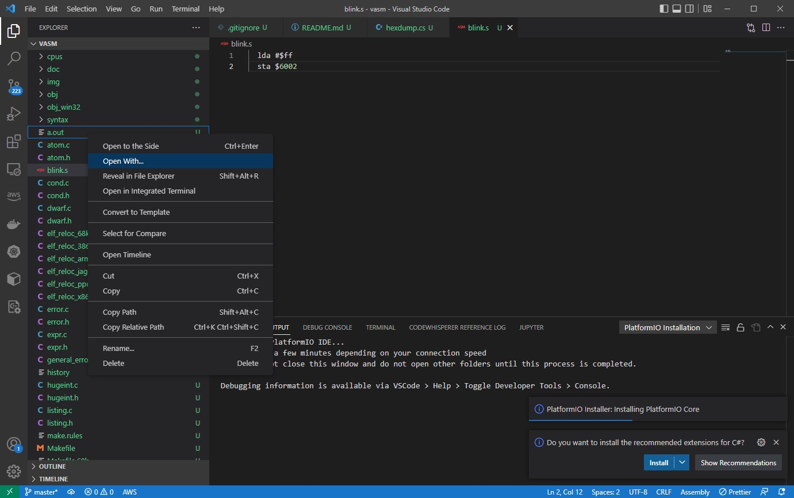
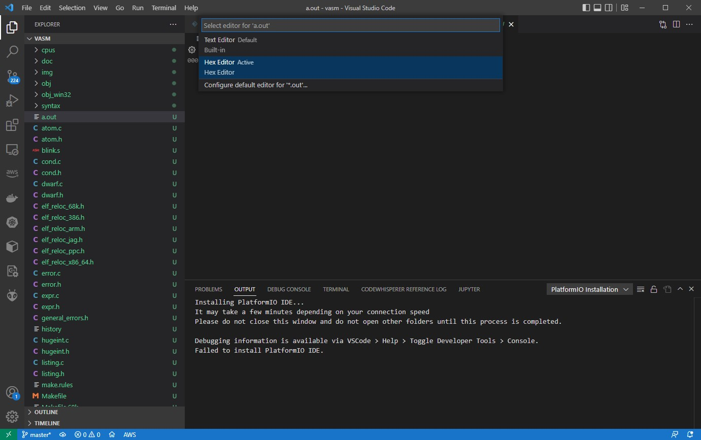
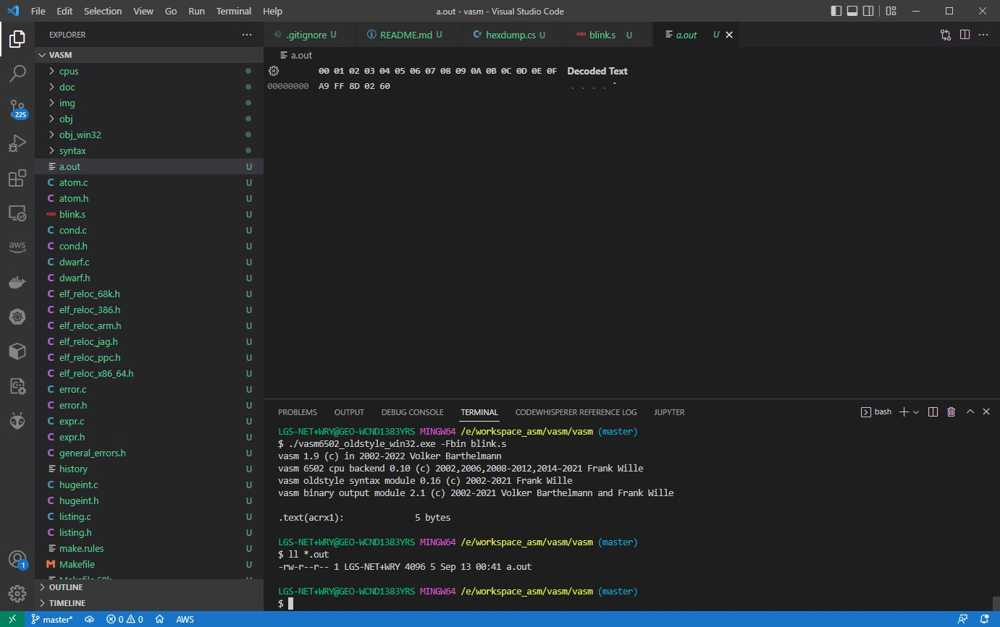

# vasm

A portable and retargetable assembler.

* [vasm](http://sun.hasenbraten.de/vasm)
* [Compilation Instructions](http://sun.hasenbraten.de/vasm/index.php?view=compile)
* [vasm docs](http://sun.hasenbraten.de/vasm/release/vasm.html)
* [example](https://www.youtube.com/watch?v=oO8_2JJV0B4&ab_channel=BenEater)
* [minipro](https://gitlab.com/DavidGriffith/minipro)
* [XGecu](http://www.xgecu.com/en/download.html)
* [6502-Assembler-For-VSCode](https://github.com/zyr2288/6502-Assembler-For-VSCode/blob/master/README.en.md)
* [win10 pacman package manager](https://www.msys2.org/)

## 1. Setup with Visual Studio 2017


```sh
E:\workspace_asm\vasm\>mkdir obj_win32
E:\workspace_asm\vasm\>nmake /f Makefile.Win32 CPU=6502 SYNTAX=oldstyle

$ cd asm/
$ ../bin/vasm6502_oldstyle_win32.exe -Fbin -dotdir blink.s
vasm 1.9 (c) in 2002-2022 Volker Barthelmann
vasm 6502 cpu backend 0.10 (c) 2002,2006,2008-2012,2014-2021 Frank Wille
vasm oldstyle syntax module 0.16 (c) 2002-2021 Frank Wille
vasm binary output module 2.1 (c) 2002-2021 Volker Barthelmann and Frank Wille

.text(acrx1):              5 bytes

$ ll *.out
-rw-r--r-- 1 LGS-NET+WRY 4096 5 Sep 13 00:41 a.out
```

## 2. Inspect with the hex editor

1. _Right-click_ > Open With..
   
2. Select the _Hex Editor_
   
3. The _Hex Editor_
   

Add the _hexdump_ in mingw

```sh
$ export PATH=$PATH:/c/msys64/mingw64/bin:/c/msys64/usr/bin
$ hexdump.exe -C -L a.out
00000000  a9 ff 8d 02 60 a9 50 8d  00 60 6a a9 55 8d 00 60  |....`.P..`j.U..`|
00000010  4c 0a 80 00 00 00 00 00  00 00 00 00 00 00 00 00  |L...............|
00000020  00 00 00 00 00 00 00 00  00 00 00 00 00 00 00 00  |................|
*
00007ff0  00 00 00 00 00 00 00 00  00 00 00 00 00 80 00 00  |................|
00008000
```

## 3. Arduino MEGA 2560

* [Docs](https://docs.arduino.cc/hardware/mega-2560)
* [Prog. Reference](https://www.arduino.cc/reference/en/)
* [Multiple Serial Ports](https://docs.arduino.cc/built-in-examples/communication/MultiSerialMega)